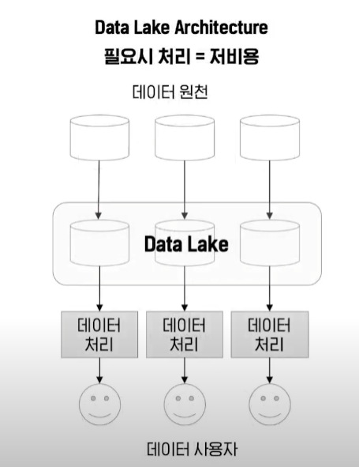

# SQL and NoSQL Database fundamentals

### ✏️데이터 베이스 정의

> 구조화된 정보 또는 데이터의 조직화된 모음

* 일반적으로 데이터베이스 관리 시스템(DBMS)에 의해 제어됨

### ✏️데이터베이스의 진화

* 계층적 데이터베이스(1:M) 

* 네트워크 데이터베이스 (M:N)

* 관계형 데이터 베이스

* NoSQL 데이터베이스

#### 🏸 왜 NoSQL ?

* 데이터란 초기 컴퓨터가 도입 되었을 때 업무 프로그램의 처리 결과를 단순 기록하는 수준

* 업무의 전산화가 진전되며 많은 데이터 생산 -> 많은 데이터를 분석 및 의사결정에 활용

* 많은 데이터를 분석하기 위해서는 여러 업무 시스템에 보관된 데이터에 접근해야함

  * 1차 문제 발생

    * 업무 시스템이 100개, 분석 시스템이 100개라면 최대 $$100 \times 100 = 10000$$

    

  * 문제 해결

    * 하나의 구조화된 데이터 저장소에 데이터를 모아서 처리

    

* 많은 데이터를 구조화된 상태로 저장하는 관계형 데이터베이스 발전 (SQL)

* 이후 컴퓨터가 모든 업무에 적용되기 시작 -> 데이터가 폭발적으로 생성(빅데이터)

  * 2차 문제 발생
    * 빅데이터의 90%는 비구조적 데이터(text, image, video, sound, etc) -> 데이터의 모습을 미리 정할 수 없음 (스키마 정의의 어려움)
    * 데이터의 사이즈가 너무 -> 데이터 웨어하우스의 확장 필요(비용 문제 발생)
  * 문제 해결
    * 데이터 생성된 형태 그대로 한 곳에 분산하여 저장

  

* NoSQL이 주목받기 시작

### ✏️SQL(Structured Query Language)이란?

> 관계형 데이터베이스(RDMBS)

* 데이터를 쿼리, 조작 및 정의하고 액세스 제어를 제공하기 위해 거의 모든 관계형 데이터베이스에서 사용되는 프로그래밍 언어

* 고정된 행과 열로 구성된 테이블에 데이터를 저장

* 각 열은 하나의 속성, 행에는 각 열의 데이터 형식에 맞는 데이터

* 테이블의 구조와 타입 등을 사전에 정의하고, 맞는 형태의 데이터만 삽입 가능

* 관리 시스템 종류

  * MySQL
  * Oracle
  * SQLite
  * MariaDB
  * PostgresSQL

  

### ✏️ 관계형 데이터베이스의 장점

* ACID 준수 ex) 은행 이체 : 데이터베이스의 모든 업데이트를 추적하고 트랜잭션이 완료되기 전에 명령이 실패하면 모든 과정을 다시 롤백
  * 의미 : 데이터베이스 트랜잭션이 안전하게 수행된다는 것을 보장하기 위한 성질
  * 원자성(Atomicity)
    * 트랜잭션과 관련된 작업들이 부분적으로 실행되다가 중단되지 않은 것을 보장
  * 일관성(Consistency)
    * 트랜잭션이 실행을 성공적으로 완료하면 언제나 일관성 있는 데이터베이스 상태로 유지
  * 독립성(Isolation)
    * 트랜잭션을 수행 시 다른 트랜잭션의 연산 작업이 끼어들지 못하도록 보장하는 것을 의미
  * 지속성(Durability)
    * 성공적으로 수행된 트랜잭션은 영원히 반영되어야 함을 의미
  * [구현 방법](https://ko.wikipedia.org/wiki/ACID#%EA%B5%AC%ED%98%84)
* 데이터 정확도
  * 기본키, 외래키를 사용하여 중복 정보가 없는지 확인 가능 -> 반복되는 정보가 없기에 데이터 정확성을 강화하는데 도움이 됨
* 표준화
  * 정규화 프로세스에는 데이터 이상 현상을 줄이거나 제거하는 방식으로 데이터를 구성하는 작업이 포함

### ✏️ 관계형 데이터베이스의 단점

* 확장성
  * 데이터 크기 또는 엑세스 빈도 증가로 확장이 필요한 경우 수직 확장이 필요(시스템의 하드웨어 개선) -> 비용과 상한선 문제 발
* 유연성
  * 엄격한 스키마로 인해 데이터 구조 변경이 매우 어려움
* 성능
  * 테이블 수와 각 테이블의 데이터 양에 따라 쿼리를 수행하는 데 걸리는 시간이 매우 오래 걸릴 수 있음*

### ✏️ NoSQL이란?

> 관계형 데이터베이스를 뺀 나머지 유형을 총칭

* 데이터의 형태가 고정되어 있지 않은 데이터베이스

* 유연한 스키마

* NoSQL에서는 데이터를 읽어올 때 스키마에 따라 데이터를 읽어 옴 (SQL은 스키마에 맞춰 데이터를 입력)

* 종류

  * key-value 타입

    * 속성을 Key-Value의 쌍으로 나타내는 데이터를 배열의 형태로 저장
    * Redis, Dynamo

    

  * 문서형 (Document) 데이터베이스

    * 데이터를 테이블이 아닌 문서처럼 저장
    * JSON과 유사한 형식
    * 각각의 문서는 하나의 속성에 대한 데이터를 가지고 있고, 컬렉션이라고 하는 그룹으로 묶어서 관

    

  * Wide-Column Store 데이터베이스

    * 데이터베이스의 열에 대한 데이터를 집중적으로 관리하는 데이터베이스
    * 각 열에는 key-value 형식으로 데이터 저장, 컬럼 패밀리라고 하는 열의 집합체 단위로 데이터 처리
    * 하나의 행에 많은 열 포함 가능
    * 데이터 처리에 필요한 열을 유연하게 선택할 수 있어 규모가 큰 데이터 분석에 주로 사용
    * Cassandra, Hbase

    

  * 그래프 데이터베이스

    * 자료구조의 그래프와 비슷한 형식으로 데이터 간의 관계를 구성
    * 노드(node)에 속성별(entities)로 데이터를 저장
    * 각 노드간의 관계는 선(edge)로 표현
    * Neo4J, InfiniteGraph

    

### 참고 문헌

http://www.incodom.kr/SQL

https://www.oracle.com/kr/database/what-is-database/

https://www.mongodb.com/ko-kr/nosql-explained

https://devuna.tistory.com/73

https://hanamon.kr/%EA%B4%80%EA%B3%84%ED%98%95-%EB%8D%B0%EC%9D%B4%ED%84%B0%EB%B2%A0%EC%9D%B4%EC%8A%A4-%EC%84%A4%EA%B3%84-%EA%B4%80%EA%B3%84-%EC%A2%85%EB%A5%98/

https://www.ibm.com/docs/ko/ims/15.3.0?topic=ims-comparison-hierarchical-relational-databases

https://www.youtube.com/watch?v=CCyahOXQGFo

https://www.youtube.com/watch?v=XJEqvxvmWxo

https://www.bearpooh.com/163