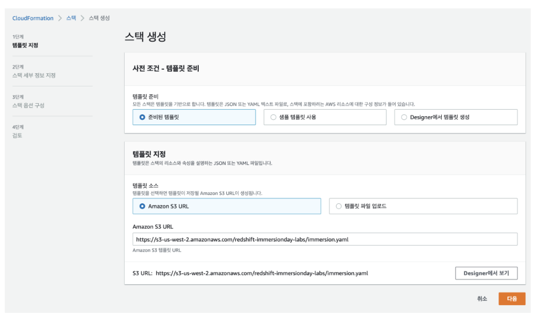

# AWS Redshift

## 이론

### ✏️데이터 트렌드

> The world's most valuable resource is no longer oil, but data

#### 데이터 분석 제약사항

* 다양성
  * 원천 데이터/종류의 다양함
  * 다각도 분석 필요
  * 데이터 크기 및 속도

> AWS DW, Data Lake, DB 를 통합하여 분석

* 성능
  * 느린 성능
  * 관리의 어려움
  * 확장의 어려움

> 일반적인 DW 대비 최대 3배 성능 보장

* 비용
  * 예상치 못한 비용 증가
  * 도구의 고착화
  * 보안 이슈

> 필요한 만큼만 On-demand, RI (기간을 정해 데이터를 미리 예약하여 사용)로 선택 시 최대 75% 절감


### ✏️기존 DW 아기텍처 제약 사항

* 기존 온프레미스 기반 DW ***Dark Data*** (수집은 되었지만 의사결정이나 분석에 정상적으로 활용할 수 없는 데이터)유발
* ***[DW silo(각 부서, 사업단위나, 브랜치별로 데이터가 일치하지 않는 증상)](https://www.tibco.com/ko/reference-center/what-is-a-data-silo)***로 인한 통합 분석 및 인사이트 도출 문제점 발생


### ✏️Redshift 인스턴스

* RA3 : storage에 포커스
* DC2 : 컴퓨팅에 최적화 

### ✏️자동 WLM (WorkLoad Management)

* Adaptive concurrency
  * 워크로드 수행 시간을 기반으로 동시성 레벨 적응
* Smarter preemption
  * 높은 우선순위 쿼리가 낮은 순위의 쿼리를 선점할 수 있도록 제

* Imporoved ML prediction model
  * 성능 저하없이 시스템의 자원을 최대한 활용하여 더 많은 쿼리 수행
* Turbo-boost mode/ SQA(Short Query Acceleration)
  * 쿼리가 감지되었을 때 대기 쿼리가 많은 자원을 필요로 하지 않을 경우


### ✏️동시성 확장

> 예상치 못한 요청 증가에도 유연하게 동시성 확장 가능

대기 상태 쿼리가 Compute 자원이 필요할 경우 단 시간 (몇 초 이내)에 다중 클러스터로 확장


### ✏️Redshift Architecture

-> 단일 클러스터 DW뿐만 아니라 데이터 Silo를 제거하여 폭넓은 데이터 활용 가능

* 클라우드에 최적화된 MPP(대용량 병렬 처리) 기반 DW, [Columnar](https://118k.tistory.com/400)  기반 OLAP DB

* Leader 노드

  * SQL 엔드 포인트
  * 메타데이터 관리
  * 병렬처리 구성 및 ML 최적화
  * 2개 이상 노드 구성 시 비용 제외

* Compute 노드 | Slice

  * 다수의 Slice로 구성
  * Slice는 가상적인 컴퓨팅 엔진 단위
  * Slice는 독립적인 메모리 및 디스크 공간을 할당 받아 Leader가 Compute 노드에 요청한 워크로드를 수행
  * Leader 노드는 Slice 단위로 데이터를 분산하고 쿼리 및 DB 작업을 배정
  * 열기반 스토리지
  * 병렬적으로 쿼리 수행
  * S3: Load, unload, backup, restore

  

> 클러스터 = Leader 노드 + Compute 노드


### ✏️결과 캐싱 - 일초 미만의 쿼리 응답 속도

> 쿼리 실행 시간을 단축을 위한 쿼리 결과 메모리 캐싱

* 기본 활성화 (관련 파라메터 enable_result_cache_for_session)
* 캐시 조건
  * 쿼리에 사용되는 객체에 대한 엑세스 권한 보유
  * redshift 쿼리 관련 파라메터 및 조회하는 테이블내 데이터의 미변경
  * 리더 노드 사이즈 및 쿼리 결과 크기를 기준으로 캐시
  * SVL_QLOG 뷰의 "source_query" 항목을 통해 확인

### ✏️결과 캐싱 - 일초 미만의 쿼리 응답 속도

> 장기 쿼리로 인한 체감 성능 저하 완화 및 동시성 확보

* 머신 러닝 알고리즘을 기반으로 단기 쿼리 판단
* 장기 쿼리뒤에서 단기 쿼리가 대기하지 않도록 SQA 전용 큐에서 단기 쿼리 실행
* 우선 시행 기본값은 5초


### ✏️노드 선택의 기준

* DC 또는 DS
  * IO Latency 요구 사항 및 필요 스토리지 용량
* 노드의 사이즈
  * 쿼리의 수행 패턴 (Slice Level, Node Level)
    * ex) Node 단위에서 데이터를 주고받는다 -> network으로 데이터를 주고 받는다. -> 속도에 극
    * 나의 쿼리 형태가 데이터를 서로 주고 받는 형태다 -> 노드 사이즈를 큰 걸 사용해야함
    * slice의 로컬에 데이터가 없더라도 network까지 가지 않고 slice간에 데이터를 주고 받을 수 있음
  * 결과 캐싱 사용 여부
  * 리더 노드 전용 함수 및 최종 Sorting, Aggregation (집계) 의 사용
    * 리더 노드 전용 함수
      * AGE
      * CURRENT_TIME
      * CURRENT_TIMESTAMP
      * LOCALTIME
      * ISFINITE
      * NOW

### ✏️Redshift Spectrum 개요

> S3 데이터를 테이블에 적재하지 않고도 정형 및 비정형 데이터를 효율적으로 쿼리

* 데이터 로딩 없이 즉각적인 쿼리 지원
* 데이터 생애주기 티어링(warm/cold) 구축 가능
* Amazon Redshift Spectrum 전용 노드 활용
* S3를 활용한 [Materialized View](http://www.gurubee.net/lecture/1857) 적용 가능


### ✏️Redshift 신규 기능

* Amazon redshift ML

  > SQL을 활용한 머신러닝 모델 생성 및 학습

  * SQL 을 사용하여 ML 모델 생성, 학습, 배포
  * 적합한 머신러닝 알고리즘 자동 선택
  * 모델에 적합한 컬럼 선택 및 전처리 자동 지원

* 반정형 데이터 지원

  * 빠르고 효율적인 JSON 데이터 처리

  

* DATA API 사용

* 자동 테이블 최적화 작업

  > 인공지능 기반 테이블 디자인을 자동으로 최적

  * 자동 정렬키 및 배포키 적용


## 실습

### 1. Redshift IAM 사용자 추가


### 2. 클러스터 생성 및 연결

* CloudForamtion 템플릿을 이용하여 Amazon Redshift 클러스터 설



### 3. 데이터 베이스 연결


### 3. 샘플 쿼리 실행

``` redshift
SELECT * FROM pg_user
```

### 4. 테이블을 클러스터에 생성 

```redshift
DROP TABLE IF EXISTS partsupp;
DROP TABLE IF EXISTS lineitem;
DROP TABLE IF EXISTS supplier;
DROP TABLE IF EXISTS part;
DROP TABLE IF EXISTS orders;
DROP TABLE IF EXISTS customer;
DROP TABLE IF EXISTS nation;
DROP TABLE IF EXISTS region;

CREATE TABLE region (
	R_REGIONKEY bigint NOT NULL,
  	R_NAME varchar(25),
  	R_COMMENT varchar(152))
diststyle all;
                      
CREATE TABLE nation(
  	N_NATIONKEY bigint NOT NULL,
  	N_NAME varchar(25),
  	N_REGIONKEY bigint,
  	N_COMMENT varchar(152))
diststyle all;
                      
CREATE TABLE customer(
	C_CUSTKEY bigint NOT NULL,
	C_NAME varchar(25),
	C_ADDRESS varchar(40),
	C_NATIONKEY bigint,
	C_PHONE varchar(15),
	C_ACCTBAL decimal(18,4),
	C_MKTSEGMENT varchar(10),
	C_COMMENT varchar(117))
diststyle all;
                      
CREATE TABLE orders(
	O_ORDERKEY bigint NOT NULL,
	O_CUSTKEY bigint,
	o_ORDERSTATUS varchar(1),
	O_TOTALPRICE decimal(18, 4),
	O_ORDERDATE Date,
	O_ORDERPRIORITY varchar(15),
	O_CLERK varchar(15),
	O_SHIPPIORITY Integer,
	O_COMMENT varchar(79))
distkey (O_ORDERKEY)
sortkey (O_ORDERDATE);
CREATE TABLE part (
	P_PARTKEY bigint NOT NULL,
	P_NAME varchar(55),
	P_MFGR varchar(25),
	P_BRAND varchar(10),
	P_TYPE varchar(25),
	P_SIZE integer,
	P_CONTAINER varchar(10),
	P_RETAILPRICE decimal(18, 4),
	P_COMMENT varchar(23))
diststyle all;
CREATE TABLE lineitem(
	L_ORDERKEY bigint NOT NULL,
	L_PARTKEY bigint,
	L_SUPPKEY bigint,
	L_LINENUMBER integer NOT NULL,
	L_QUANTITY decimal(18,4),
	L_EXTENDERPRICE decimal(18,4),
	L_DISCOUNT decimal(18,4),
	L_TAX decimal(18,4),
	L_RETURNFLAG varchar(1),
	L_LINESTATUS varchar(1),
	L_SHIPDATE date,
	L_COMMITDATE date,
	L_RECEIPDATE date,
	L_SHIPINSTRUCT varchar(25),
	L_SHIPMODE varchar(10),
	L_COMMENT varchar(44))
distkey (L_ORDERKEY)
sortkey (L_RECEIPDATE);
CREATE TABLE supplier(
	S_SUPPKEY bigint NOT NULL,
	S_NAME varchar(25),
	S_ADDRESS varchar(40),
	S_NATIONKEY bigint,
	S_PHONE varchar(15),
	S_ACCTBAL decimal(18, 4),
	S_COMMENT varchar(101))
diststyle all;
CREATE TABLE partsupp(
	PS_PARTKEY bigint NOT NULL,
	PS_SUPPKEY bigint NOT NULL,
	PS_AVAILQTY integer,
	PS_SUPLLYCOST decimal(18,4),
	PS_COMMENT varchar(199))
diststyle even;
```

* 문법은 기존 sql과 동일
* 분산


* diststyle all -> 모든 데이터를 모든 클러스터에 생성

* diststyle even -> 데이터를 나누어서 클러스터에 생성 
  * ex) 100개 데이터를 클러스터 10개에 10개씩 나누어 생성
* distkey -> 동일 키는 동일한 위치에 저장 시킴
  * groupby 해서 연산 시 slice 안에서 처리 가능
  * 다른 테이블의 레코드 경우에도 동일한 분산키를 사용하느 경우 동일 슬라이스에 저장
    * join에서 매우 유리

​	

* 적절한 분산키의 선택
  * 목적
    * 각 노드에 군등하게 데이터 분산
    * 데이터 이동의 최소화
  * 분산키에 적절한 컬럼
    * 가장 큰 테이블에서 조인에 활용되는 컬럼
    * Group By 조건에서 사용되는 컬럼
  * 분산키에 적절하지 않은 컬럼
    * 데이터의 몰림을 유발하는 컬
  * 팁
    * 가장 큰 Dimension Table의 Primary 키와 Fact Table의 Foreign 키를 Dist Key로 선택
    * 나머지 조인이 되는 조건의 Dimesion Table은 Distribution All (300만 개 이하의 경우 데이터 분산 타입을 전체 (ALL) 로 선택해도 무)

* Fact Table / Dimension Table

  * Fact Table

    * 정량적인 실제값들이 들어오는 테이블
    * 여러 테이블들의 primary keys를 가지고 있는 테이블이라고 생각해도 됨

    * star schema에서 가운데 테이블

  * Dimension Table

    * Fact table의 컬럼별 세부적인 정보를 담고 있는 테이

  > Fact Table은 Even으로 Dimension Table 은 ALl 로 구성하면 network를 타는 경우를 줄일 수 있

* 정렬 키

  > 정렬 키가 지정된 테이블의 경우 데이터 로드시 정렬 순서대로 디스크에 저장

  * 정렬키의 종류

    * 정렬 키 : 테이블의 단일 컬럼의 값을 기준으로 데이터를 정렬하여 저장

    * 복합 정렬키 (Compund Sort Key):

      * 다수의 컬럼을 활용 (최대 6개) 활용하여 정렬 키로 활용
      * 선언한 순서에 따라 순차적으로 정렬되어 저장됨

      

    * 인터리브 정렬키 (Interleaved Sort Key)

      * 다수의 컬럼을 활용 (최대 8개) 활용하여 정렬 키로 활용
      * 정렬 키에서 각 열, 즉 열의 하위 집합에 똑같은 가중치를 부여

      

    * 선택적 필터링

      > 정렬 키를 활용할 경우 쿼리 속도가 빨라짐 (ZONE MAP)

      

### 5. S3에 저장된 샘플 데이터 업로드

```redshift
COPY region FROM 's3://redshift-immersionday-labs/data/region/region.tbl.lzo'
iam_role default
region 'us-west-2' lzop delimiter '|' COMPUPDATE PRESET;
                       
COPY nation FROM 's3://redshift-immersionday-labs/data/nation/nation.tbl.'
iam_role default
region 'us-west-2' lzop delimiter '|' COMPUPDATE PRESET;
                       
COPY customer FROM 's3://redshift-immersionday-labs/data/customer/customer.tbl.'
iam_role default
region 'us-west-2' lzop delimiter '|' COMPUPDATE PRESET;      
                       
COPY orders FROM 's3://redshift-immersionday-labs/data/orders/orders.tbl.'
iam_role default
region 'us-west-2' lzop delimiter '|' COMPUPDATE PRESET;
                    
COPY part FROM 's3://redshift-immersionday-labs/data/part/part.tbl.'
iam_role default
region 'us-west-2' lzop delimiter '|' COMPUPDATE PRESET;     
                      
COPY supplier FROM 's3://redshift-immersionday-labs/data/supplier/supplier.json' manifest
iam_role default
region 'us-west-2' lzop delimiter '|' COMPUPDATE PRESET;      
                       
COPY lineitem FROM 's3://redshift-immersionday-labs/data/lineitem-part/'
iam_role default
region 'us-west-2' gzip delimiter '|' COMPUPDATE PRESET;    
                      
COPY partsupp FROM 's3://redshift-immersionday-labs/data/partsupp/partsupp.tbl.'
iam_role default
region 'us-west-2' lzop delimiter '|' COMPUPDATE PRESET;     
```


* 압축 (COMPUPDATE PRESET)
  * 압축을 기반으로 디스크 사용량 및 I/O 줄일 수 있음
  * COPY 커멘드 사용시 10만 행을 우선 적제 후 압축 옵션 평가 (COMPUDATE on)
  * ANALYZE COMPRESSION 커멘드를 통해 현재 압툭 (인코딩)에 대한 평가 후 'ALTER TABLE'로 변경 가능


### 6. 테이블 관리 - Analyze

> 쿼리플래너(옵티마이저)가 최적의 실행 계획을 작성할 수 있도록 정기적으로 통계 메타데이터를 업데이트 해야

* 통계 업데이트 자동 실행
  * CREATE(TEMP) TABLE AS SELECT
  * SELECT INTO
  * COPY 
* 통계 업데이트를 실행해줘야 하는 경우
  * 기존 데이터의 5% 이상에 대해 변경이 있는 경우
  * 외래키를 추가하거나 삭제한 경우
  * Vaccum 실행 후

```redshift
analyze table;
```


### 7. 테이블 관리 - VACUUM

> 삭제 및 수정이 빈번하게 발생했을 경우 VACUUM

* 디스크 조각 모음과 비슷

* ex)

  * ORDERS 테이블의 초기 적재 상태 확인

  ``` redshift
  select col, count(*)
  from stv_blocklist, stv_tbl_perm
  where stv_blocklist.tbl = stv_tbl_perm.id and
  stv_blocklist.slice = stv_tbl_perm.slic and
  stv_tbl_perm.name = 'orders' and
  col <= 5
  group by col
  order by col;
  ```

  

  * 일부 행 삭제

  ```redshift
  delete orders where o_orderdate between '1997-01-01' and '1998-01-01';
  ```

  

  * 삭제 전과 후가 동일
  * vacuum 명령어 실행

  ```redshift
  vacuum delete only orders;
  ```

  


### 8. 참고 문헌

https://tkwon.tistory.com/4
https://docs.aws.amazon.com/ko_kr/redshift/latest/mgmt/working-with-clusters.html
https://pearlluck.tistory.com/27
https://hyunki1019.tistory.com/149
https://www.youtube.com/watch?v=w3-P6s97ZsE&t=2s
https://www.youtube.com/watch?v=i_l8ZxRuL0k&t=4s