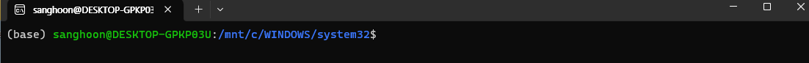
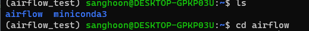
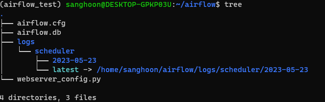
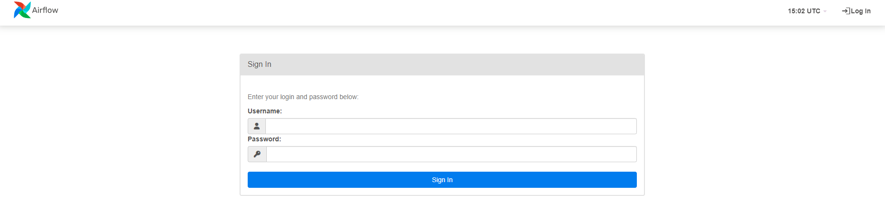
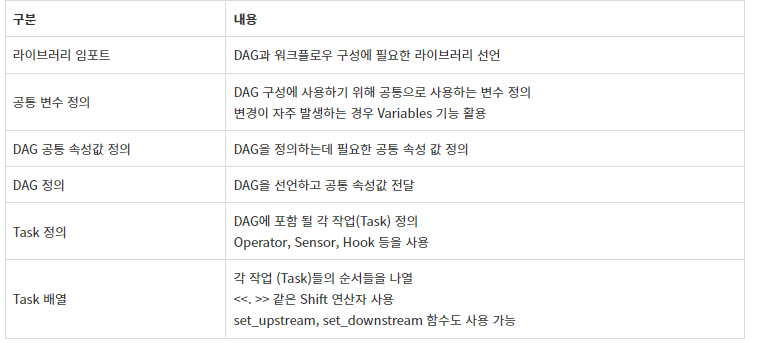
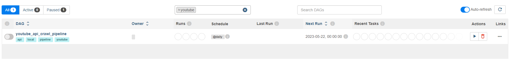
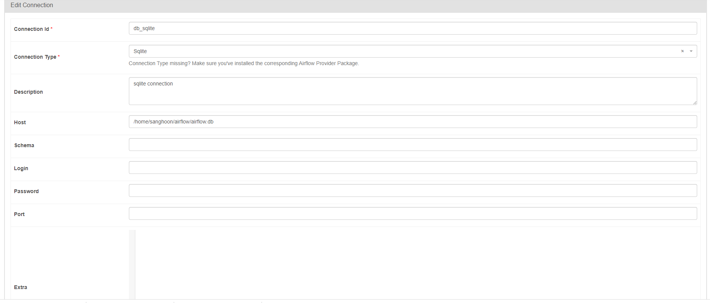
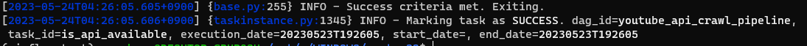
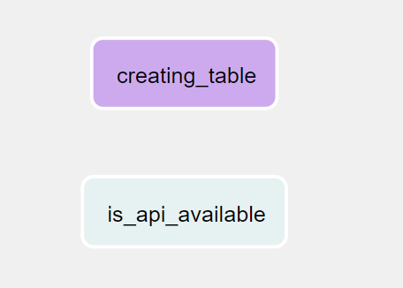

# Apache Airflow

## Airflow란?

> 여러가지 태스크들(데이터셋 생성, 모델 학습 등)을 일련의 그래프로 연결하고 스케줄링, 모니터링 등 파이프라인 관리를 위한 다양한 기능을 제공하고 있는 Workflow Management Platform


* Airflow는 윈도우 환경을 지원하지 않습니다.. 따라서 윈도우에서 ubuntu 환경을 사용할 수 있는 wsl 을 활용하여 실습을 진행하였습니다.


## WSL 설치 및 conda 설정

### wsl 설치

1. **관리자 권한**으로 powershell 실행
2. wsl --install
3. username, password 설정 후 재부팅
4. wsl 실행



### wsl (ubuntu) 에서 conda 설치

1. miniconda 홈페이지로 이동하여 linux에 맞는 conda 설치
2. 설치된 경로로 이동하여 파일 실행

```powershell
sh Miniconda3-latest-Linux-x86_64.sh
```

### wsl 에서 conda 환경변수 설정

1. wsl에서 code ~/.zshrc 입력
2. zshrc 파일에 아래와 같이 추가 후 저장

```python
export PATH="/home/<username>/miniconda3/bin:$PATH"
```

3. wsl 에 conda 입력하여 정상적으로 출력되는지 테스트

### conda 가상환경 생성 및 활성화

```power
conda create -n <가상 환경 이름> python=3.10
conda activtae <가상 환경 이름>
```

## Airflow 실습 진행

### Airflow 설치

* pip를 통한 airflow 설치

```powershell
pip3 install apache-airflow
```

* airflow 입력하여 정상 설치 되었는지 확인

* home 디렉토리에서 airflow 폴더로 이동

  

* DB 초기화

  * DB는 Airflow의 DAG와 TASk 등을 관리하기 때문에 셋팅이 필요

  ```powershell
  airflow db init
  ```

  

  * airflow.cfg
    * airflow의 환경 설정 파일
  * airflow.db
    * DB 관련 정보
  * logs
    * 로그 관리

* dags 디렉토리 생성

```powershell
mkdir dags
```

### Airflow 계정 생성

* 방법 1

```powershell
airflow user create -u admin -p admin -f sanghoon -l park -r Admin -e sjhty123@naver.com
```

* 방법 2

```powershell
airflow user create -u --username admin --firstname sanghoon --lastname park --role Admin --email sjhty123@naver.com
```

### Airflow 실행

* 웹 서버 실행

```powershell
airflow webserver -p 8080
```

* web 브라우저를 활용해 접속 (아래 주소를 주소창에 입)

```
localhost:8080
```



### Airflow DAG 구성하기

#### DAG란? 

> Airflow에서 실행할 작업들을 순서에 맞게 구성한 워크플로우를 의미

* Directed Acyclic Graph
* DAG를 구성하는 각 작업들을 태스크(Task) 함.
* DAG는 Task의 관계와 종속성을 반영하여 구조화됨
* 화살표 방향 순서대로 태스크 실행, 분기 실행과 병렬 실행 가능

#### DAG 코드 구조



#### Operator

* Action Operator : 간단한 연산 수행 오퍼레이터, airflow.operators 모듈 아래에 존재
* Transfer Operator : 데이터를 옮기는 오퍼레이터
* Sensor : 태스크 실행 트리거를 기다리는 오퍼레이터

### DAG 프로그래밍


1. SQL 테이블 생성
2. 데이터 가져올 수 있는지 확인


#### DAG 틀 만들기

```python
from datetime import datetime
import json
from airflow import DAG
from googleapiclient.discovery import build

from airflow.providers.sqlite.operators.sqlite import SqliteOperator
from airflow.providers.http.sensors.http import HttpSensor
from airflow.providers.http.operators.http import SimpleHttpOperator
from airflow.operators.python import PythonOperator
from airflow.operators.bash import BashOperator

default_args = {
    'start_date':datetime(2023,1,1)
}

api_key = 'apikey'

with DAG(
    dag_id = "youtube_api_crawl_pipeline",
    schedule_interval = "@daily",
    default_args = default_args,
    tags = ['youtube','local', 'api', 'pipeline'],
    catchup=False,) as dag:

    pass
```



1. SQL 테이블 생성

```python
createing_table = SqliteOperator(
        task_id = "creating_table",
        sqlite_conn_id = 'db_sqlite',
        sql = '''
            CREATE TABLE IF NOT EXISTS youtube_crawl_result(
                title TEXT,
                description TEXT,
                viewcount INT,
                likecount INT,
                commentcount INT
            )
        '''
    )
```



2. 데이터 가져올 수 있는지 확인

```python
is_api_available = HttpSensor(
        task_id = 'is_api_available',
        http_conn_id = 'youtube_crawl_api',
        endpoint = 'youtube/v3/search',
        # headers = {
        #     'key':api_key
        # },
        request_params={
            'key':api_key,
            'part':'snippet',
            'channelId':'UC1LzvduPSKr9puUr',
            'order':'date',
            'maxResults':5,
            'publishedAfter': '2022-01-01T00:00:00Z',
            'publishedBefore': '2022-12-31T23:59:59Z',
            'type' : 'video',
        },
        response_check=lambda response : response.json()
    )

```

* is_api_avilable 라는 task만 수행하여 확인

```powershell
airflow tasks test youtube_api_crawl_pipeline is_api_available
```





https://velog.io/@clueless_coder/Airflow-%EC%97%84%EC%B2%AD-%EC%9E%90%EC%84%B8%ED%95%9C-%ED%8A%9C%ED%86%A0%EB%A6%AC%EC%96%BC-%EC%99%95%EC%B4%88%EC%8B%AC%EC%9E%90%EC%9A%A9